# Data Engineering - Project Report

### Project Group Members
- **A. Lis (Adel), **
- **M. Taciak (Monika), mta275**
- **N. Micek (Nikolina), nmk490**
- **Y. Yan (Yoyo), yyn480**

---

## Data Fields
| **Column** | **Description** | **Example Value** | **Data Type** |
|-----------|----------------|------------------|----------|
| `faa` | **FAA Code** (Three-letter identifier for the destination airport) | `"AAF"` (Apalachicola Regional Airport) | `object` |
| `name` | **Destination Airport Name** | `"Apalachicola Regional Airport"` | `object` |
| `lat` | **Latitude** (Geographical coordinate of the airport) | `29.72750092` | `float64` |
| `lon` | **Longitude** (Geographical coordinate of the airport) | `-85.02749634` | `float64` |
| `alt` | **Altitude** (Elevation of the airport in feet) | `20` | `int64 ` |
| `tz` | **Time Zone Offset** (Relative to UTC) | `-5` (Apalachicola in UTC-5) | `float64` |
| `dst` | **Daylight Saving Time (DST) Usage** | `"A"` (Active, follows DST) | `object` |
| `tzone` | **Timezone in "tz" (Olson) format** | `"America/New_York"` | `object` |


---

## Libraries Used
The following Python libraries were used in this project for **data processing, visualization, and geospatial analysis**:
- `pandas` – For reading and processing the dataset.
- `plotly` – For interactive visualizations.
- `geopy` – For geographic distance calculations.
- `matplotlib` - For descriptive statistics
- `timezonefinder` - For inferring the missing value
- `seaborn` - Statistical data visualization
- `numpy` - For numerical operations
- `scikit-learn` - For cluster data
- `networkx` - For building the airport network
- `Nominatim` - For finding the nearest airport to a city
- `dash` - Used to initially build and test dashboard concepts and functionality in a demo environment.
- ...
  
### Data Cleaning
```python
print("missing values in each column:\n", df.isnull().sum()) 
```
missing values in each column:
 faa        0
name       0
lat        0
lon        0
alt        0
tz        48
dst       48
tzone    119

No missing values in FAA codes, airport names, coordinates, and altitude.
Missing tz (time zone offset) and dst (daylight saving time info) in 48 rows.
tzone (time zone name) missing in 119 rows, which may impact time-based analysis.

Since tz (UTC offset), dst (Daylight Saving Time), and tzone (time zone name) are related, we can infer their missing values instead of dropping them. This will help retain more data and improve the accuracy of our analysis.
### Data Transformation 
Since altitude (alt) is given in feet, we need to convert it to meters.
```python
df["alt_meters"] = df["alt"] * 0.3048 # use alt_meters to replace alt
```
Convert tz to Integer
```python
df["tz"] = df["tz"].astype("Int64")
```
|    | **Data Type** |
|------|------|
| `tz` | Int64 |

### Descriptive Statistics
After inferring the missing values, we used various charts and graphs to analyze patterns and relationships between different attributes in the dataset.
```python
print("missing values in each column:\n", df.isnull().sum()) 
```
|  | Latitude (`lat`) | Longitude (`lon`) | Altitude (`alt`) | Time Zone (`tz`) | alt_meters |
|-----------|----------------|------------------|------------------|------------------|-------------------|
| **Count** | 1251 | 1251 | 1251 | 1251 | 1251 |
| **Mean** | 40.9333 | -103.4659 | 1121.9920 | -6.3333 |  341.983164 |
| **Std Dev** | 10.1935 | 28.1121 | 1602.5218 | 2.0812 | 488.448652 |
| **Min** | 19.7214 | -176.6460 | -115.0000 | -10.0000 | -35.052000 |
| **25%** | 34.1035 | -117.8760 | 96.0000 | -8.0000 | 29.260800 |
| **50% (Median)** | 39.3451 | -95.9125 | 551.0000 | -6.0000 | 167.944800 |
| **75%** | 44.3167 | -83.2863 | 1226.0000 | -5.0000 | 373.684800 |
| **Max** | 71.29 | 174.11 | 9070.000000 | 8.00 | 2764.536000 |

This dataset contains **1251 records**, with each row representing a **landing airport**.  
Most destinations are primarily located in the **mid-latitude regions (30°N to 50°N)**, with some airports in **tropical and Arctic regions**.  

The majority of airports are in **North America**, within the **UTC-10 to UTC-5 time zones**, but some flights reach **Asia and the Pacific**.  
Most airports are **near sea level**, though a few **high-altitude airports exist in mountainous regions**.  

#### To better understand the relationships between different variables, we can create several visualizations.
<div align="center">
  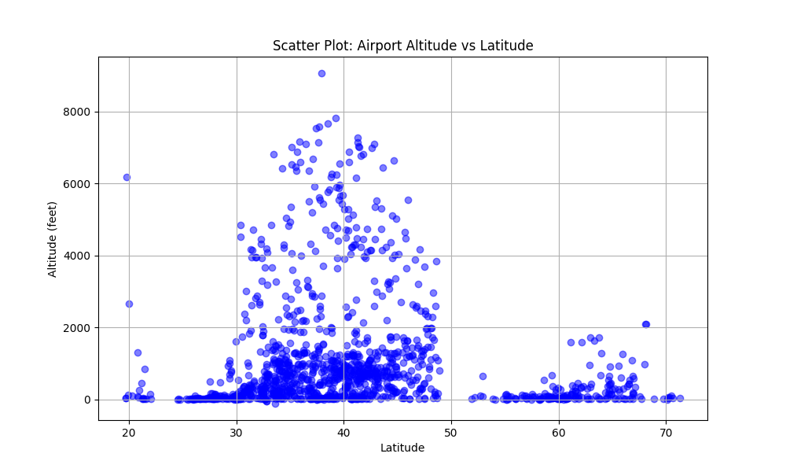
  
  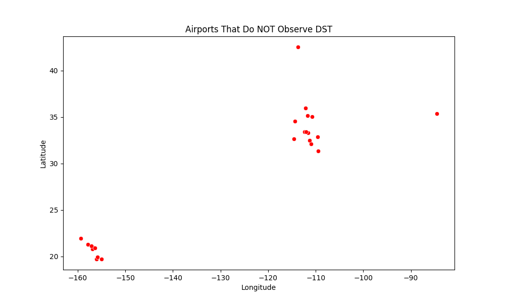
</div>

The following airports **do not observe DST** and are located in specific regions:  
**Airports around latitude ~20° and longitude ~-160°**, **Airports around latitude ~30-35° and longitude ~-110°**. Later can visualizing these airports on a map to see the locations.

### Visualization 
#### World Map && US Map
<div align="center">
  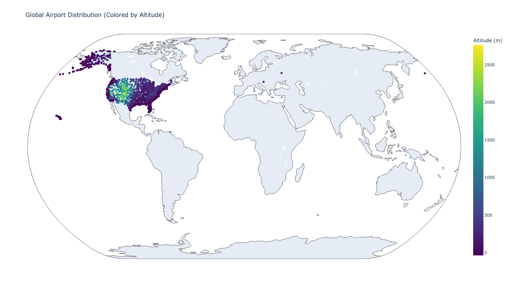
  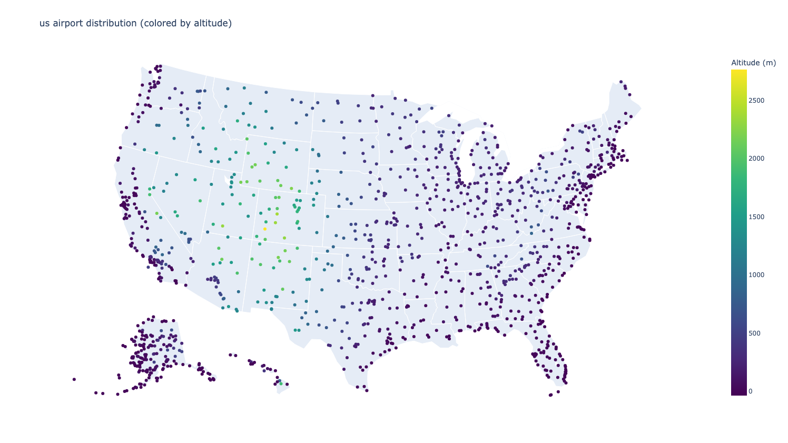
</div>

By cross-validating the world map and the U.S. map, we can identify that only two airports are located outside the United States:
Taszári Air Base (FAA: TZR) – located in Hungary.
Oryol Yuzhnyy Airport (FAA: OEL) – located in Oryol, Russia.

#### Plot Multiple Lines
We assume that all starting points are located at John F. Kennedy Airport in New York City to simplify the process of drawing flight paths.

#### Euclidean Distance && Geodesic Distance
Distances calculated manually with formulas. The output is given in kilometers.
<div align="center">
  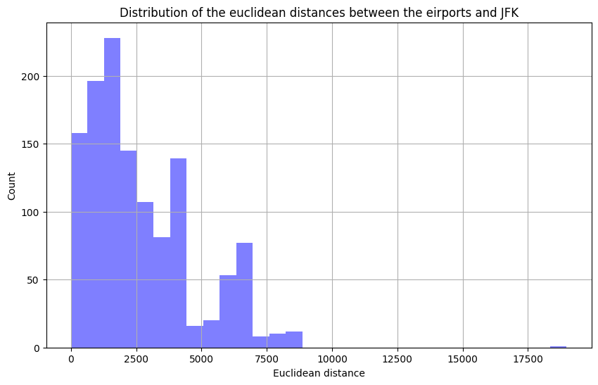
  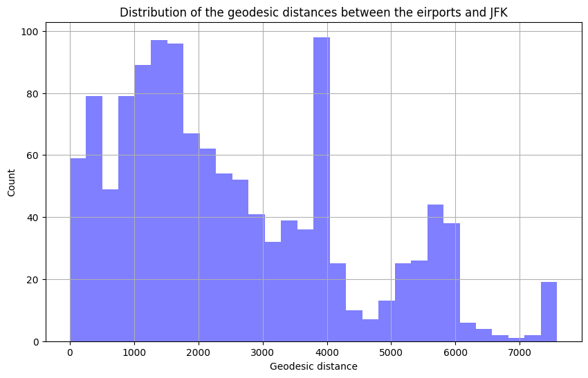
</div>

#### Time Zones
<div align="center">
  
</div>


#### More Visualizations 
#### Cluster
Use DBSCAN. Set the range is 80km.
<div align="center">
  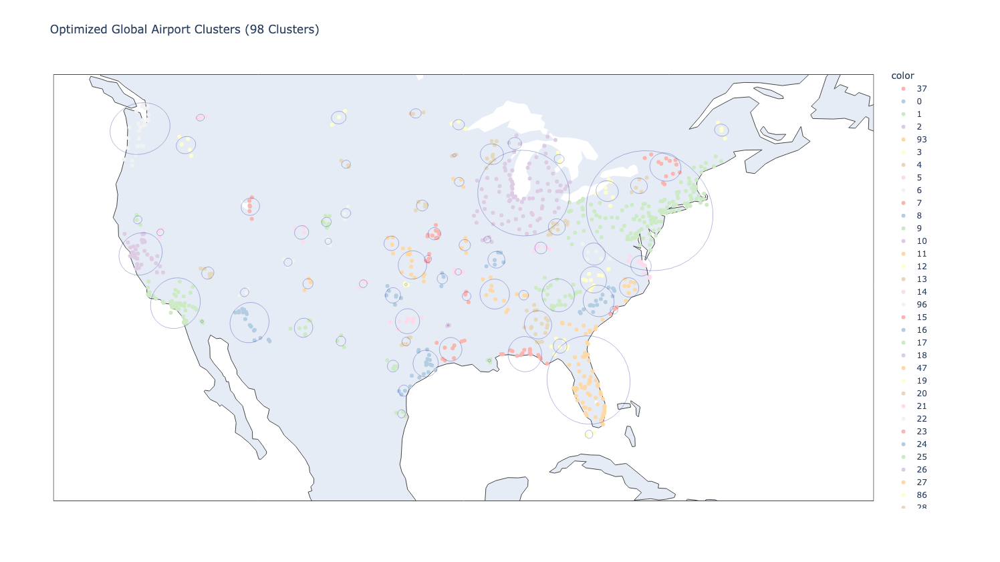
</div>

#### Undirected Airport Graph
Choose 5 neighbors.
<div align="center">
  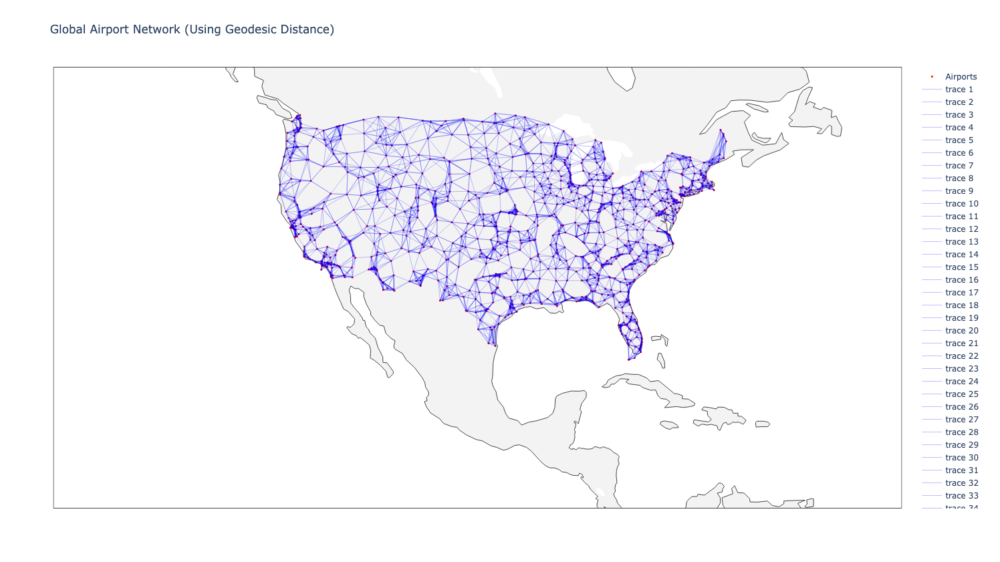
</div>

## Dashboard Features Demo
This part for add any ideas and build the basic demo to test your idea.
### Idea1-input 2 cities name, find the nearest airport to 2 given city, then plot the flight path between them
```python
plot_flight_between_cities("New York", "London")
plot_flight_between_cities("San Francisco", "Tokyo")
```
<div align="center">
  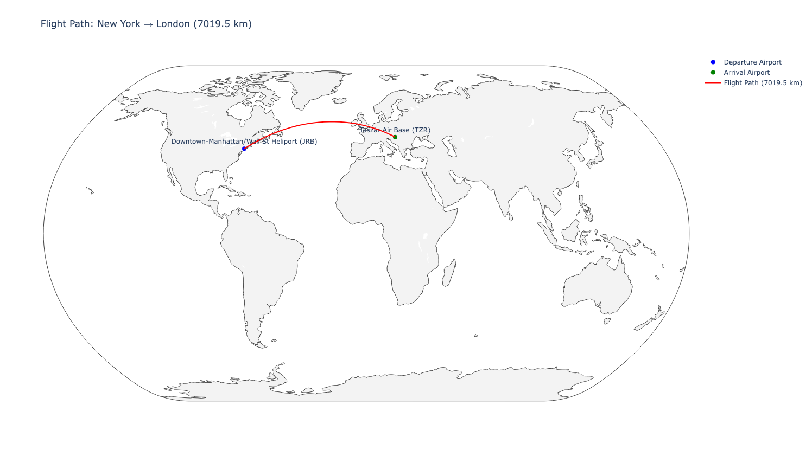London" width="45%"/>
  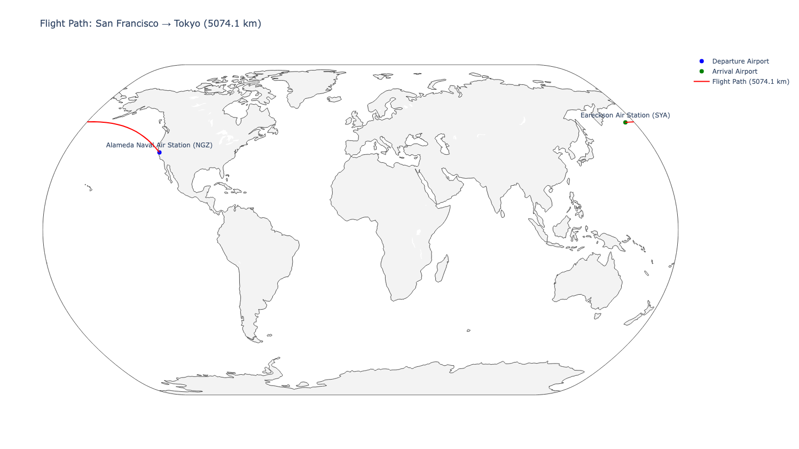Tokyo" width="45%"/>
</div>

### Idea2-simulate a flight from JFK to the nearest airport in each cluster
Select the nearest airports from the top ten clusters in the previous aggregation map, choosing the airport closest to the cluster center.
```python
if __name__ == "__main__":
    app.run_server(debug=True)
```
<div align="center">
  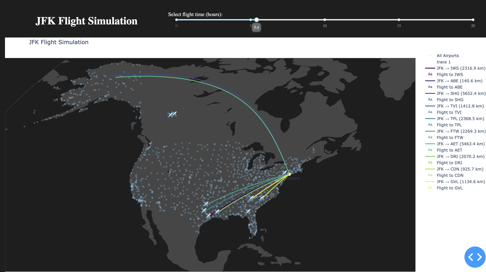
</div>


