# Data Engineering - Project Report

### Project Group Members

- **A. Lis (Adel), ali248**
- **M. Taciak (Monika), mta275**
- **N. Micek (Nikolina), nmk490**
- **Y. Yan (Yoyo), yyn480**

---

## Libraries Used

The following Python libraries were used in this project for **data processing, visualization, and geospatial analysis**:

- `pandas` – For reading and processing the dataset.
- `plotly` – For interactive visualizations.
- `geopy` – For geographic distance calculations.
- `matplotlib` - For descriptive statistics
- `timezonefinder` - For inferring the missing value
- `seaborn` - Statistical data visualization
- `numpy` - For numerical operations
- `scikit-learn` - For cluster data
- `networkx` - For building the airport network
- `Nominatim` - For finding the nearest airport to a city
- `dash` - Used to initially build and test dashboard concepts and functionality in a demo environment.
- `math` - Calculate distance
- `streamlit` Build final dashboard
- `base64` For using png image as ui
- `sqlite3` For database
- `datetime` For date range selection

## Part 1,2

### Data Fields

`airports.csv`
| **Column** | **Description** | **Example Value** | **Data Type** |
| ---------- | ------------------------------------------------------------------ | --------------------------------------- | ------------- |
| `faa` | **FAA Code** (Three-letter identifier for the destination airport) | `"AAF"` (Apalachicola Regional Airport) | `object` |
| `name` | **Destination Airport Name** | `"Apalachicola Regional Airport"` | `object` |
| `lat` | **Latitude** (Geographical coordinate of the airport) | `29.72750092` | `float64` |
| `lon` | **Longitude** (Geographical coordinate of the airport) | `-85.02749634` | `float64` |
| `alt` | **Altitude** (Elevation of the airport in feet) | `20` | `int64 ` |
| `tz` | **Time Zone Offset** (Relative to UTC) | `-5` (Apalachicola in UTC-5) | `float64` |
| `dst` | **Daylight Saving Time (DST) Usage** | `"A"` (Active, follows DST) | `object` |
| `tzone` | **[Timezone in "tz" (Olson) format](https://en.wikipedia.org/wiki/Tz_database)** | `"America/New_York"` | `object` |

---

### Data Cleaning

First, we print the missing values:

```python
print("missing values in each column:\n", df.isnull().sum())
```

We obtained the following missing values for each column:

| Column | Missing Values |
| ------ | -------------- |
| faa    | 0              |
| name   | 0              |
| lat    | 0              |
| lon    | 0              |
| alt    | 0              |
| tz     | 48             |
| dst    | 48             |
| tzone  | 119            |

Since tz (UTC offset), dst (Daylight Saving Time), and tzone (time zone name) are related, we can infer their missing values instead of dropping them. This will help retain more data and improve the accuracy of our analysis.

1. **Infer Timezone Based on Geographic Coordinates (tzone):**  
   If there are missing values in the `tzone` column, we use the `TimezoneFinder` library to determine the correct timezone for each airport based on its latitude and longitude, thereby filling in the missing `tzone` values.

2. **Fill in the Timezone Offset (tz) Using a Known Mapping:**  
   First, we extract the existing mapping between `tzone` and `tz` from the data and construct a mapping dictionary. Then, for missing values in the `tz` column, we fill them in by looking up the corresponding `tz` value using the `tzone`.

3. **Infer Daylight Saving Time (dst) Based on tzone:**  
   For the missing `dst` values, we define a custom function `infer_dst_from_tzone` that determines the daylight saving time setting based on the content of `tzone`:

   - If `tzone` contains `"America/"`, set it to `'A'`.
   - If `tzone` contains `"Europe/"`, set it to `'E'`.
   - Otherwise, set it to `'N'`.
   - If `tzone` is missing, set it to `'U'`.

4. **Manual Filling of Missing Values:**

   ```python
   print(df[df["tz"].isnull()])
   ```

   The output shows:

   | faa | name                     | lat       | lon         | alt  | tz  | dst | tzone         |
   | --- | ------------------------ | --------- | ----------- | ---- | --- | --- | ------------- |
   | BYI | Burley Municipal Airport | 42.542599 | -113.772003 | 4150 | NaN | A   | America/Boise |

   Because the auto-inference (using TimezoneFinder and the mapping dictionary) might fail or return an incorrect value for "America/Boise", we need to manually override it with the correct value to ensure the data's accuracy.
   
5. **Correct Erroneous Data:**  
   We also correct any erroneous data. For example, for records in the `tz` column with a value of `8`, we correct them to `-8` to ensure data accuracy.

### Data Transformation

Since altitude (alt) is given in feet, we need to convert it to meters.

```python
df["alt_meters"] = df["alt"] * 0.3048 # use alt_meters to replace alt
```

Convert tz to Integer

```python
df["tz"] = df["tz"].astype("Int64")
```

|      | **Data Type** |
| ---- | ------------- |
| `tz` | Int64         |

### Descriptive Statistics

After inferring the missing values, we used various charts and graphs to analyze patterns and relationships between different attributes in the dataset.

```python
print("missing values in each column:\n", df.isnull().sum())
```

|                  | Latitude (`lat`) | Longitude (`lon`) | Altitude (`alt`) | Time Zone (`tz`) | alt_meters  |
| ---------------- | ---------------- | ----------------- | ---------------- | ---------------- | ----------- |
| **Count**        | 1251             | 1251              | 1251             | 1251             | 1251        |
| **Mean**         | 40.9333          | -103.4659         | 1121.9920        | -6.3333          | 341.983164  |
| **Std Dev**      | 10.1935          | 28.1121           | 1602.5218        | 2.0812           | 488.448652  |
| **Min**          | 19.7214          | -176.6460         | -115.0000        | -10.0000         | -35.052000  |
| **25%**          | 34.1035          | -117.8760         | 96.0000          | -8.0000          | 29.260800   |
| **50% (Median)** | 39.3451          | -95.9125          | 551.0000         | -6.0000          | 167.944800  |
| **75%**          | 44.3167          | -83.2863          | 1226.0000        | -5.0000          | 373.684800  |
| **Max**          | 71.29            | 174.11            | 9070.000000      | 8.00             | 2764.536000 |

This dataset contains **1251 records**, with each row representing a **landing airport**.  
Most destinations are primarily located in the **mid-latitude regions (30°N to 50°N)**, with some airports in **tropical and Arctic regions**.

The majority of airports are in **North America**, within the **UTC-10 to UTC-5 time zones**, but some flights reach **Asia and the Pacific**.  
Most airports are **near sea level**, though a few **high-altitude airports exist in mountainous regions**.

#### To better understand the relationships between different variables, we can create several visualizations.

<div align="center">
  
  
  
</div>

The following airports **do not observe DST** and are located in specific regions:  
**Airports around latitude ~20° and longitude ~-160°**, **Airports around latitude ~30-35° and longitude ~-110°**. Later can visualizing these airports on a map to see the locations.

### Visualization

#### World Map && US Map

<div align="center">
  
  
</div>

By cross-validating the world map and the U.S. map, we can identify that only two airports are located outside the United States:
Taszári Air Base (FAA: TZR) – located in Hungary.
Oryol Yuzhnyy Airport (FAA: OEL) – located in Oryol, Russia.

#### Plot Multiple Lines

We assume that all starting points are located at John F. Kennedy Airport in New York City to simplify the process of drawing flight paths.

<div align="center">
  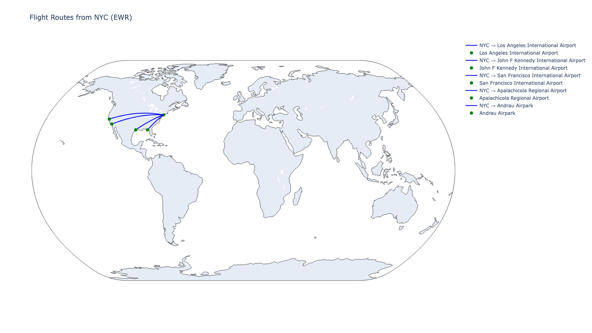
</div>

#### Euclidean Distance && Geodesic Distance

Distances calculated manually with formulas. The output is given in kilometers.

<div align="center">
  
  
</div>

#### Time Zones

<div align="center">
  
  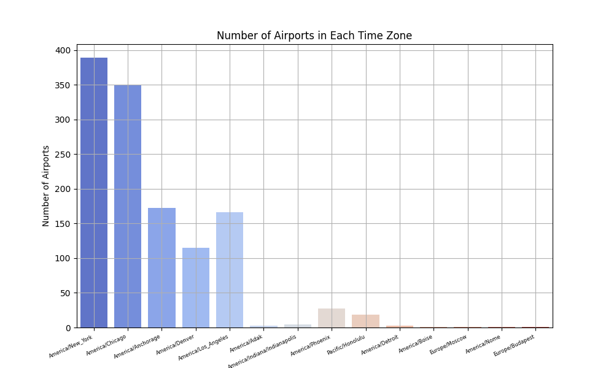
</div>

In the timezone data, most airports are located in the Eastern (America/New_York) and Central (America/Chicago) time zones, while a small number of airports are in Europe (Moscow/Budapest). The number of airports in the Western time zones (Pacific and Mountain) is relatively lower due to the vast and sparsely populated regions, which aligns with our previous map analysis.

Acoording to the figure, we found 3 time zones in Alaska. America/Adak, America/Nome, America/Anchorage.

Alaska (America/Anchorage) has significantly more airports than other regions, likely due to weak road infrastructure, making air travel essential for many remote areas. This has led to a high number of small regional airports and a well-developed feeder airline network.

The presence of airports in the America/Indiana/Indianapolis time zone suggests historical complexities in time regulation in that region. Parts of Indiana follow independent time zone rules within the Eastern Time Zone, and America/Indiana/Indianapolis has its own time zone designation, possibly due to historical reasons.

The first figure highlights airports in UTC 8. After extracting airports with tz=8, we found that all of them are in the America/Los_Angeles time zone. The correct tz value should be -8, indicating an error in the database entry. Then we replaced 8 to -8.

```python
df.loc[df['tz'] == 8, 'tz'] = -8 # fix incorrect tz value
```

#### More Visualizations

#### Cluster

Use DBSCAN. Set the range is 80km.

<div align="center">
  
</div>

#### Undirected Airport Graph

Choose 5 neighbors.

<div align="center">
  
</div>

In the current DBSCAN results with an 80km radius:

Texas (Houston, Dallas) forms multiple clusters.
The East Coast has several dense clusters.
The West Coast (Los Angeles, San Francisco) does not form dense clusters.
This may be related to economic patterns and industry structure:

East Coast & Texas → High economic activity areas

New York (JFK, LGA, EWR) is one of the world's largest financial centers, with extremely high economic activity and a dense network of surrounding airports.
Texas (Dallas, Houston) is an energy hub with strong business connections, leading to a dense airport network.
Major East Coast cities (Boston, Philadelphia, Washington, etc.) have a high concentration of commercial flights, resulting in high airport density.
West Coast (California) → Fewer airports but stronger hubs

The number of airports is smaller, but they serve as major hubs.
Due to the greater distances between cities in California, airports are not as densely packed as in New York or Texas.
In DBSCAN clustering, they are more likely to be classified as outliers rather than clusters.
The results of the undirected airport network graph are similar to the DBSCAN clustering results.

## Part 3

### Data Fields

Flights Table (`flights`)
| **Field Name** | **Data Type** | **Description** |
|---------------------|--------------|----------------|
| `year` | INTEGER | Year of the flight (typically 2023) |
| `month` | INTEGER | Month of the flight (1-12) |
| `day` | INTEGER | Day of the flight (1-31) |
| `dep_time` | INTEGER | **Actual departure time** (Format: HHMM, e.g., 1342 means 13:42) |
| `sched_dep_time` | INTEGER | **Scheduled departure time** (Format: HHMM, e.g., 1330 means 13:30) |
| `dep_delay` | REAL | **Departure delay** (in minutes, negative means early departure) |
| `arr_time` | INTEGER | **Actual arrival time** (Format: HHMM, e.g., 1625 means 16:25) |
| `sched_arr_time` | INTEGER | **Scheduled arrival time** (Format: HHMM, e.g., 1600 means 16:00) |
| `arr_delay` | REAL | **Arrival delay** (in minutes, negative means early arrival) |
| `carrier` | TEXT | **Airline carrier code** (e.g., `AA` for American Airlines) |
| `flight` | INTEGER | **Flight number** (unique identifier, e.g., 1543) |
| `tailnum` | TEXT | **Aircraft registration number** (e.g., `N12345`) |
| `origin` | TEXT | **Origin airport code** (e.g., `JFK` for John F. Kennedy International Airport) |
| `dest` | TEXT | **Destination airport code** (e.g., `LAX` for Los Angeles International Airport) |
| `air_time` | REAL | **Flight duration** (in minutes) |
| `distance` | REAL | **Flight distance** (in miles) |
| `hour` | REAL | **Scheduled departure hour** (24-hour format) |
| `minute` | REAL | **Scheduled departure minute** |
| `time_hour` | REAL | **Flight departure timestamp** (rounded to the hour) |

---

Airlines Table (`airlines`)
| **Field Name** | **Data Type** | **Description** |
|---------------|--------------|----------------|
| `carrier` | TEXT | **Airline carrier code** (e.g., `AA`, `DL`) |
| `name` | TEXT | **Full airline name** (e.g., `"American Airlines"`) |

---

Airports Table (`airports`)
| **Field Name** | **Data Type** | **Description** |
|--------------|--------------|----------------|
| `faa` | TEXT | **Airport code** (e.g., `JFK`, `LGA`, `EWR`) |
| `name` | TEXT | **Airport name** (e.g., `"John F. Kennedy International Airport"`) |
| `lat` | REAL | **Latitude** (geographical location) |
| `lon` | REAL | **Longitude** (geographical location) |
| `alt` | REAL | **Altitude** (in feet) |
| `tz` | REAL | **Time zone offset** (relative to UTC) |
| `dst` | TEXT | **Daylight saving time (DST) indicator** |
| `tzone` | TEXT | **Time zone name** (e.g., `"America/New_York"`) |

---

Planes Table (`planes`)
| **Field Name** | **Data Type** | **Description** |
|----------------|--------------|----------------|
| `tailnum` | TEXT | **Aircraft registration number** (e.g., `N12345`) |
| `year` | INTEGER | **Year of manufacture** |
| `type` | TEXT | **Aircraft type** (e.g., `"Fixed wing multi engine"`) |
| `manufacturer`| TEXT | **Aircraft manufacturer** (e.g., `"Boeing"`, `"Airbus"`) |
| `model` | TEXT | **Aircraft model** (e.g., `"737-800"`) |
| `engines` | INTEGER | **Number of engines** |
| `seats` | INTEGER | **Seating capacity** |
| `speed` | INTEGER | **All 0** |
| `engine` | TEXT | **Engine type** (e.g., `"Turbo-fan"`) |

---

Weather Table (`weather`)
| **Field Name** | **Data Type** | **Description** |
|---------------|--------------|----------------|
| `origin` | TEXT | **Airport code** (e.g., `JFK`, `LGA`, `EWR`) |
| `year` | INTEGER | **Year** (typically 2023) |
| `month` | INTEGER | **Month** (1-12) |
| `day` | INTEGER | **Day** (1-31) |
| `hour` | INTEGER | **Hour** (24-hour format) |
| `temp` | REAL | **Temperature (°F)** |
| `dewp` | REAL | **Dew point temperature (°F)** |
| `humid` | REAL | **Humidity (%)** |
| `wind_dir` | REAL | **Wind direction (degrees)** |
| `wind_speed` | REAL | **Wind speed (mph)** |
| `wind_gust` | REAL | **Wind gust speed (mph)** |
| `precip` | REAL | **Precipitation (inches)** |
| `pressure` | REAL | **Air pressure (inHg)** |
| `visib` | REAL | **Visibility (miles)** |
| `time_hour` | REAL | **Timestamp (rounded to the hour)** |

---

### Verify the Distances

<div align="center">
  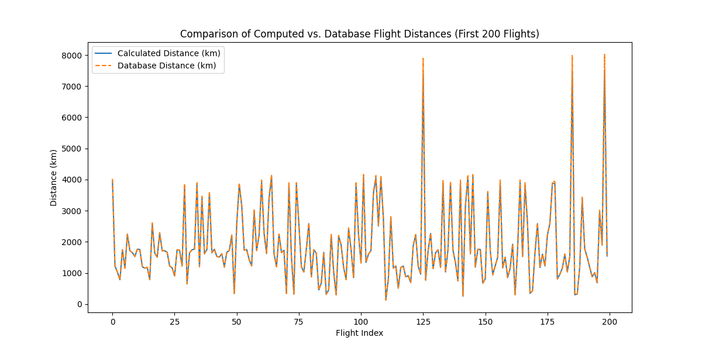
</div>
We selected the first 200 flights, and we got the same result.

### Extract NYC Airports

```python
print(df_unique_origins)
```

| **FAA** | **Name**                             | **Latitude (lat)** | **Longitude (lon)** | **Altitude (alt, ft)** | **Time Zone (tz, UTC)** | **DST** | **Time Zone Name** |
| ------- | ------------------------------------ | ------------------ | ------------------- | ---------------------- | ----------------------- | ------- | ------------------ |
| EWR     | Newark Liberty International Airport | 40.692501          | -74.168701          | 18.0                   | -5.0                    | A       | America/New_York   |
| JFK     | John F Kennedy International Airport | 40.639801          | -73.778900          | 13.0                   | -5.0                    | A       | America/New_York   |
| LGA     | La Guardia Airport                   | 40.777199          | -73.872597          | 21.0                   | -5.0                    | A       | America/New_York   |

---

### Analyse Flights Per Day

```python
plot_flight_destinations(1, 1, "JFK")
stats = get_flight_statistics(1, 1, "JFK")
print(stats)
```

Plot the flight destinations and we get flight statistics for JFK on January 1st.

<div align="center">
  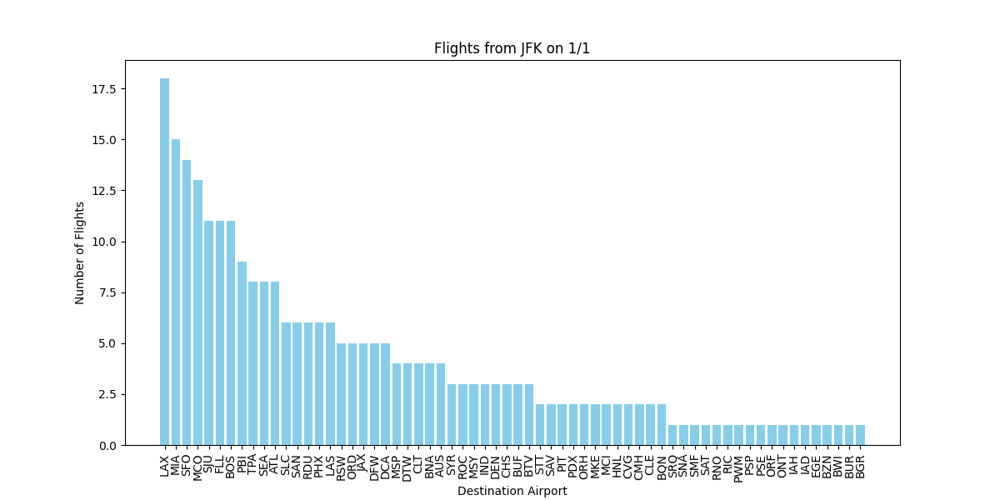
</div>

```bash
{'total_flights': 267, 'unique_destinations': 64, 'most_visited': 'LAX', 'most_visited_count': 18}
```

### Average Delays

We look at the delays of planes depending on the a) airline operating, b) month and destination, c) distance of the flight.

#### Delay per carrier

This requires joining the table airlines on flights to recover the full names of the airlines from their two-letter abbreviations. Grouping and joining is performed over these abreviatios as they are unique to their airlines. To plot these delays, simply call

```python
print(average-delay_per_carrier_plot())
```

Resulting in

<div align="center">
  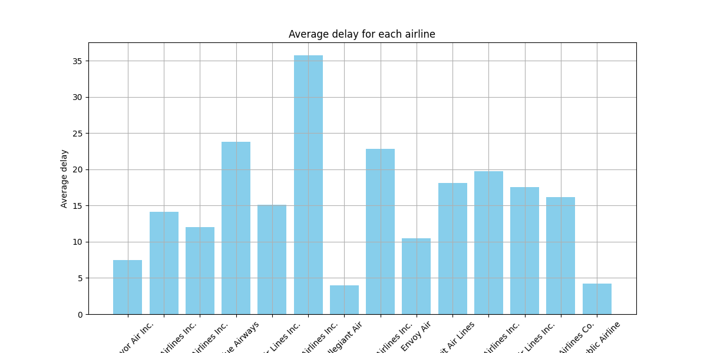
</div>

We found the airlines with the lowest delays are the Southwest Airlines Co. and the Frontier Airlines Inc. The greatest delays are to be expected when travelling with Delta Air Lines Inc. The difference between highest and lower average delays is around 30 minutes.

#### Delays per destination for given months

The flights database is filtered for the given months and destination. Then the number of rows with arr_delay > 0 is counted. To correctly use the function delays_motths_destination(months, destination), provide months as numerical values in a tuple and destination as the three letters encoding an airport as a string. For example,

```python
delays_motths_destination((1,2,3), 'ORD')
```

Returns 1898 as the number of delayed flights in January, February and March from JFK to O'Hare International Airport in Chicago (ORD).

#### Correlation between the distance and the delay

Distance can be expected to correlate positively with the average delay. Longer flight could controbute to proportionally longer elays. On another hand, more time in the air allows for potential 'catchig up' with the delay caused when departing. To investigate this relationship, we attempt at plotting a scatter plot of the delays against the distance. Since distance is a continuous feature, it needs to be first cut into bins of width 200km to make sense of th unique values. This motivated us to convert part of the database needed into a Pandas datafarme which allows for easier manipulation of data for this purpose than SQL. To plot the scatter plot simply

```python
bins_distance_delay()
```

Resulting in

<div align="center">
  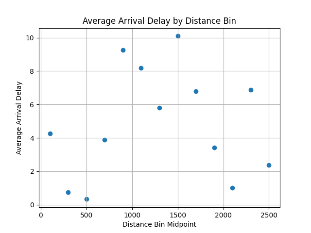
</div>

There is no correlation between these two features. As we have already sicovered, the delay can vary greatly depending on the carrier. Since some of them might be operating on mostly shorter or longer distances, we plot additional graphs of the same information but per carrier. To make the figure clearer, the data has been filtered only for carriers with flights falling into at least 10 bins. In addition, we opted for a line plot to make the correlation more visible. Call

```python
bins_distance_delay_per_carrier()
```

To obtain

<div align="center">
  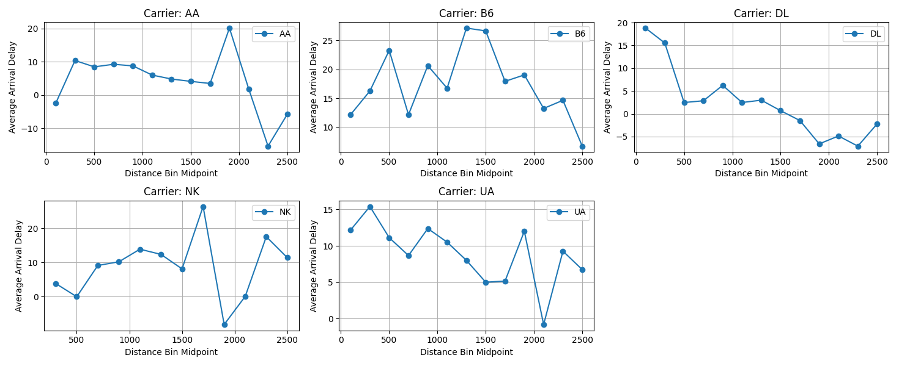
</div>

As previously, the correlation is not clear. However, it is more common for the delay to decrease as the length of flight increases. This trend is primarily visible in case of Delta Airlines.

### airport-airport analysis

### plane manufacturers

### Average speed per plane model

We performed a `SELECT` query to gather data from the `flights` table. We request the `tailnum` column (which represents the model of the plane), and then compute the values from the `distance` and `air_time` columns and save the results under a new `avg_speed` column. Query:

```python
query_tailnum = """
SELECT tailnum, AVG(distance*1.0/air_time) AS avg_speed
FROM flights
WHERE air_time > 0
GROUP BY tailnum
"""
```

We convert the data gathered into a dataframe using `pandas` with the command:

```python
tailnum_speed_df = pd.read_sql_query(query_tailnum, conn)
```

We report the dataframes above:

| tailnum | avg_speed |
| ------- | --------- |
| 190NV   | 6.754161  |
| 191NV   | 6.328948  |
| ...     | ...       |
| N998NN  | 6.703549  |
| N999JQ  | 7.464845  |

Since we have the average speed, we `UPDATE` the `planes` table with the computed averae speed per plane:

```python
cur = conn.cursor()
for _, row in tailnum_speed_df.iterrows():
    cur.execute("UPDATE planes SET speed = ? WHERE tailnum = ?", (row['avg_speed'], row['tailnum']))

conn.commit()
conn.close()
```

<div align="center">
  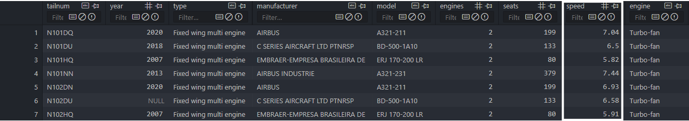
</div>

### Plane direction

We first execute three `SELECT` queries:

```python
'SELECT flight, origin, dest, time_hour FROM flights'
'SELECT origin, wind_dir, time_hour FROM weather'
'SELECT faa, lat, lon FROM airports'
```

We save the results of the queries in three dataframes `df_flights`, `df_weather`, and `df_airports`. Then we perform some merging between the dataframes:

```python
# 1) Merge df_flights and df_weather on origin/time_hour
df_flights = pd.merge(
    df_flights,
    df_weather,
    on=["origin", "time_hour"],
    how="inner"
)

# 2) Merge with df_airports to get lat/lon for the origin airport
df_flights = pd.merge(
    df_flights,
    df_airports[["faa", "lat", "lon"]],
    left_on="origin",
    right_on="faa",
    how="left"
)
df_flights.rename(columns={"lat": "lat_origin", "lon": "lon_origin"}, inplace=True)
df_flights.drop("faa", axis=1, inplace=True)  # Remove the duplicate 'faa' column

# 3) Merge with df_airports to get lat/lon for the destination airport
df_flights = pd.merge(
    df_flights,
    df_airports[["faa", "lat", "lon"]],
    left_on="dest",
    right_on="faa",
    how="left"
)
df_flights.rename(columns={"lat": "lat_dest", "lon": "lon_dest"}, inplace=True)
df_flights.drop("faa", axis=1, inplace=True)  # Remove the duplicate 'faa' column
```

For every row in `df_flights` we calculate the compass bearning by using the function
`calculate_compass_bearing`, which takes the coordinates of the origin and destination airport as arguments:

```python
for _, row in df_flights.iterrows():
    origin_coods = (row['lat_origin'], row['lon_origin'])
    dest_coords = (row['lat_dest'], row['lon_dest'])
    bearing = calculate_compass_bearing(origin_coods, dest_coords)
    bearings.append(bearing)

df_flights['bearing'] = bearings
```

In the end we computed the inner product between the compass bearing and wind direction (both in angle):

```python
for _, row in df_flights.iterrows():
    inner_product = inner_product_angle(row['wind_dir'], row['bearing'])
    inner_products.append('positive' if inner_product >= 0 else 'negative')

df_flights['innerProd'] = inner_products
```

The `df_flights` will have this structure.
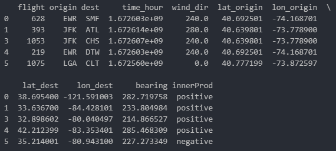

In the end, we show the graphs of the first rows where we use a polar histogram to display the wind direction and compass bearing.

<div align="center">
  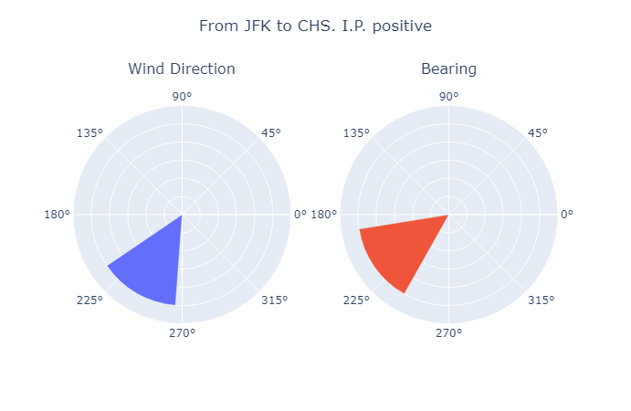
  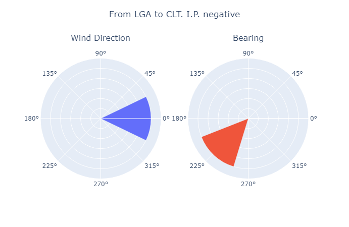
</div>
We can observe that a positive inner product indicates that the wind angle is favorable to the plane direction, meanwhile, a negative inner product indicates that the wind goes against the plane when in air

## Part 4

### Missing Values

### Look for duplicates...

### ...

## Dashboard Features Demo

This part for add any ideas and build the basic demo to test your idea.

### Idea1-input 2 cities name, find the nearest airport to 2 given city, then plot the flight path between them

```python
plot_flight_between_cities("New York", "London")
plot_flight_between_cities("San Francisco", "Tokyo")
```

<div align="center">
  London" width="45%"/>
  Tokyo" width="45%"/>
</div>

### Idea2-simulate a flight from JFK to the nearest airport in each cluster

Select the nearest airports from the top ten clusters in the previous aggregation map, choosing the airport closest to the cluster center.

```python
if __name__ == "__main__":
    app.run_server(debug=True)
```

<div align="center">
  
</div>

### Idea3-for each flight, compute the the compass direction from NYC to the destination airport, and examine the directional distribution of the departing flights.

Compute the direction (in degrees °) of each route leaving from NYC and show the distribution over a polar histogram.
The study reveals the most taken directions from NYC, and, therefore prefered destinations.

```python
df_dest['bearing'] = df_dest.apply(lambda row: calculate_bearing(nyc_lat, nyc_lon, row['lat'], row['lon']), axis=1)
```

<div align="center">
  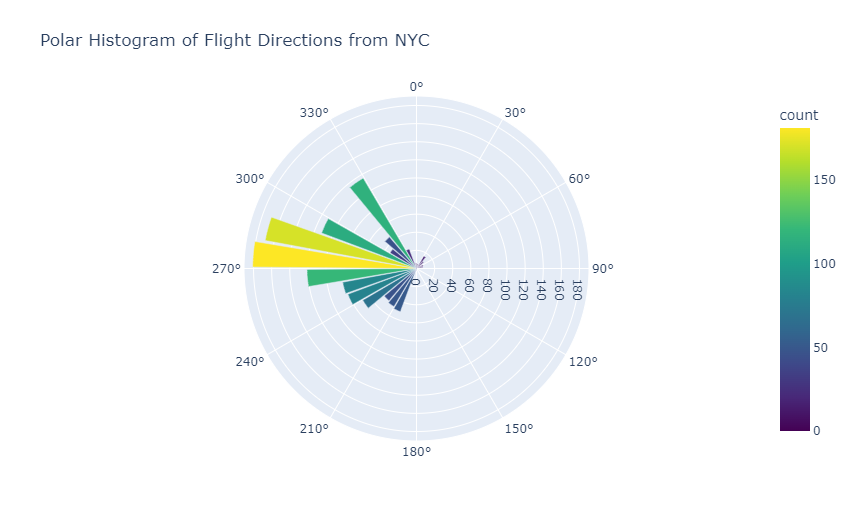London" width="55%"/>
  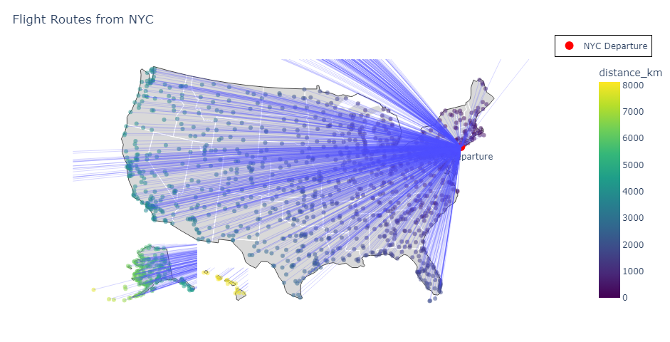Tokyo" width="55%"/>
</div>
